# Desafio BTG

Projeto destinado ao desenvolvimento de um sistema de contas digitais. Tal desafio foi elaborado pelo processo seletivo do BTG Pactual.

## Tabela de Conteúdos

- Introdução
- Tecnologias Utilizadas
- Como Rodar
- Modelo Entidade-Relacionamento
- Diagrama Entidade-Relacionamento
- Conexão Banco de Dados (AWS RDS)
- Endpoints da API
- Exemplos de uso

## Introdução

Para o desenvolvimento do sistema, foi realizada a modelagem de um banco de dados relacional contendo dados do cliente, dados da conta e dados de movimentação, trabalhando apenas com saques e depósitos.

Após a modelagem, foi feita uma API do sistema com funções de cadastro de cliente/conta, visualização de saldo, deletar dados de cliente, conta e transações; pesquisa de dados do cliente a partir do CPF, atualizar dados do cliente, visualizar lista de clientes; realizção de saque (caso o cliente tenha saldo suficiente), depósito e visualização de lista de transações da conta.

## Tecnologias Utilizadas

Para desenvolver o projeto, foi utilizado tecnologias modernas e utilizadas no BTG Pactual. 
O **PostgreSQL** foi escolhido como banco de dados, hospedado e gerenciado pelo **AWS RDS** para garantir escalabilidade e facilitar a utilização do projeto, sendo necessário apenas baixar e rodar o projeto. 
Em relação ao desenvolvimento do projeto, foi utilizado **.NET** para implementação da API e os endpoints foram documentados no **Swagger**.

## Como Rodar

#### Pre-requistos:
- .NET 6
- Visual Studio ou Visual Studio Code

#### Utilizando Visual Studio

Para rodar a aplicação usando Visual Studio, basta dar um duplo clique no arquivo DesafioBTG e em seguida clicar no ícone para rodar aplicação conforme mostra abaixo:

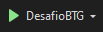

#### Utilizando Visual Studio Code
Para rodar utilizando o VS Code, basta seguir a seguinte instrução: 

Entre na pasta "project/app" e rode o comando:

```bash
dotnet run
```

## Modelo Entidade-Relacionamento

Entidades:

- Client
- Account
- Transaction

Atributos:

- Client: id_client, cpf, name, telephone, address
- Account: id_account, id_client, number, balance
- Transaction: id_transaction, id_account, value, data, type_transaction

Relacionamentos:

- Client 1 --- 1 Account

Essa modelagem está trabalhando com contas de apenas um tipo, com isso um cliente estará associado a apenas uma conta e uma conta será vinculada a apenas um cliente.

- Account 1 --- N Transaction

Uma conta pode realizar mais de uma movimentação, mas uma movimentação está associada a apenas uma conta (pois no caso trabalhado as transações são apenas de saques e depósitos).

## Diagrama Entidade-Relacionamento


Os Scripts DDL e DML estão presentes nas pastas [DDL](docs/DDL) e [DML](docs/DML).

Para a criação dos códigos de INSERT, UPDATE e DELETE dentro dos arquivos de DML, foi utlizado a função [dml_generate.py](/dml_generate.py) para gerar um arquivo .txt com as várias linhas de comando. 

Para a utilização dos scripts envolvendo a tabela Transaction, é importante informar que as inserções diretas nela (como INSERT ou UPDATE) não irão afetar o valor do saldo na tabela Account. O valor da transação altera o valor do saldo por meio dos códigos, logo, para realizar saques e depósitos é necessário utilizar a API.

## Conexão Banco de Dados (AWS RDS)

Para se conectar ao banco de dados utilizando algum software de dministração e gerenciamento de banco de dado basta utilizar as seguintes informações:
- **Host name/adress:** desafio-estagio-btg.c7u10yq6rhe5.sa-east-1.rds.amazonaws.com
- **Port:** 5432
- **Maintenence/database:** postgres
- **Username:** postgres
- **Password:** admindesafio

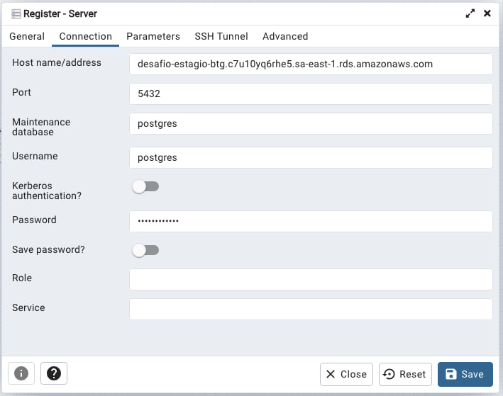


## Endpoints da API

Os endpoints foram dividos em funções ligadas aos clientes, as contas e as transações.

### Conta:


A função CreateClientAccount recebe como parâmetro os atributos do cliente (cpf, nome, telefone e endereço), cadastra ele no banco de clientes e já cria automaticamente uma conta acossiada a ele.

A função ViewBalance recebe como atributo o número da conta e retorna seu saldo.

A função DeleteClientAccount recebe como parâmetro o número da conta e apaga todas as informações no banco relacionadas as transações, a conta e ao cliente associado a ela.

### Cliente:


A função SearchClient recebe como parâmetro o cpf do cliente e retorna todas as suas informações.

A função UpdateClient recebe os atributos de cliente e atualiza os dados de nome, telefone e endereço do cliente, a busca é feita a partir do cpf.

A função ListClients não recebe parâmetros e retorna uma lista com todos os clientes cadastrados no banco de dados.

### Transações:


A função Withdrar recebe o número da conta e o valor do saque e retira esse valor de seu saldo.

A função Deposit tem uma funcionalidade parecida com a Withdraw, mas para depósitos.

A ListTransactions recebe o número da conta e retorna uma lista com os dados de transações realizadas, sendo eles o valor da transação, a data, hora e o tipo, sendo saque ou depósito.

## Exemplos de uso

Citando algumas aplicações do sistema, iremos começar com os bancos sem dados:

Tabela de clientes:


Tabela de contas:


Tabela de transações:

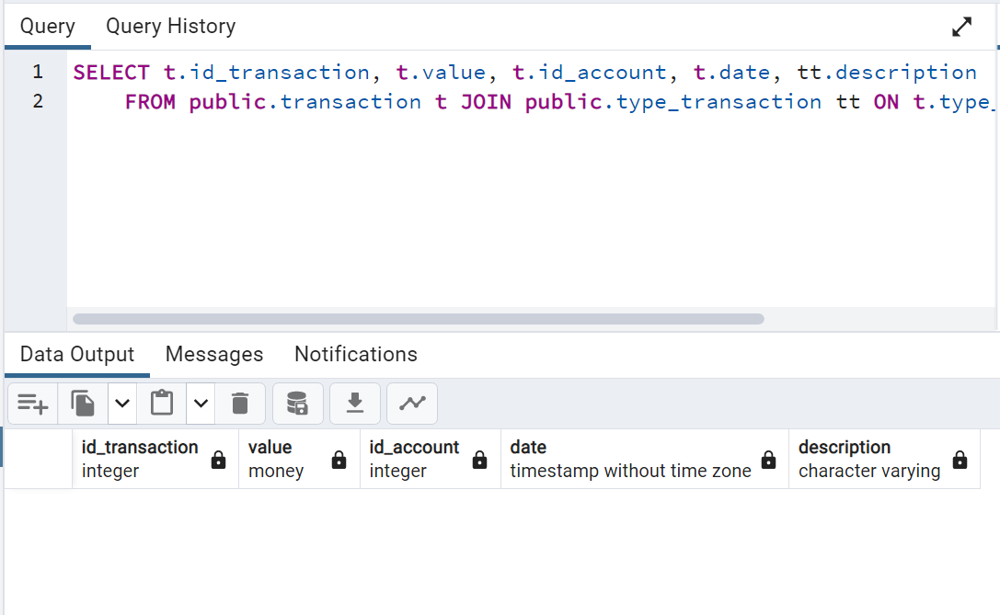

Código de SELECT acima:

```sql
SELECT t.id_transaction, t.value, t.id_account, t.date, tt.description
	FROM public.transaction t JOIN public.type_transaction tt ON t.type_transaction = tt.type;
```

Ele serve para mostrar direto se a transação é saque ou depósito, ao invés do código da transação.

A tabela type_transaction está representada abaixo:

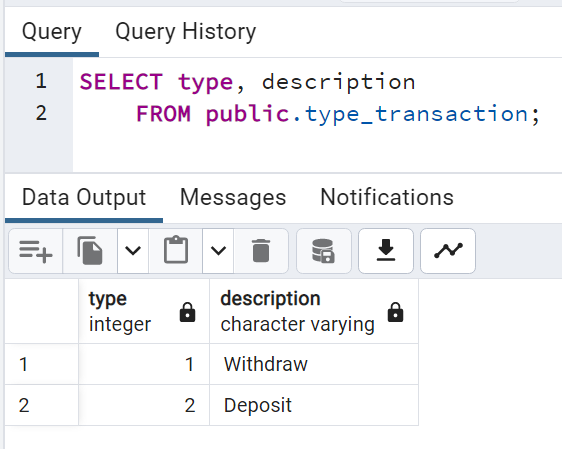

### Cadastro de clientes e contas

Vamos fazer o cadastro de 2 clientes novos:

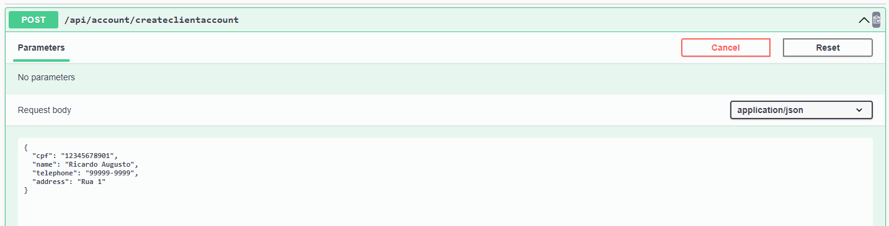

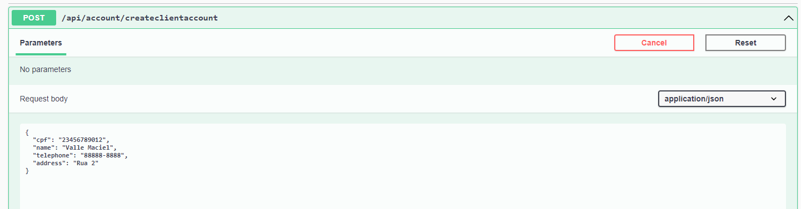

Banco com os clientes:

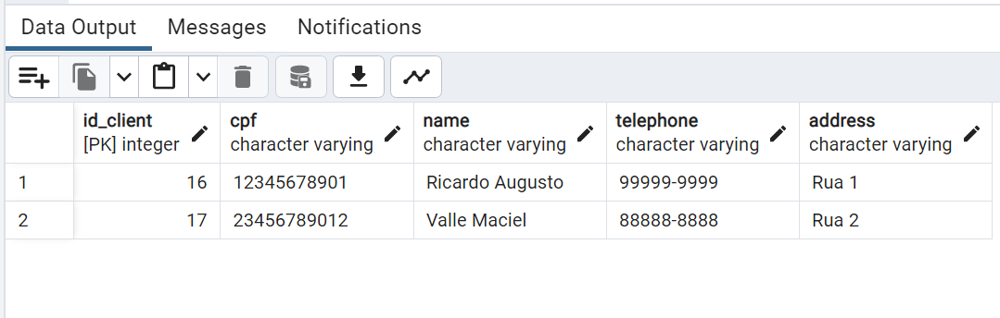

Tabela de contas:

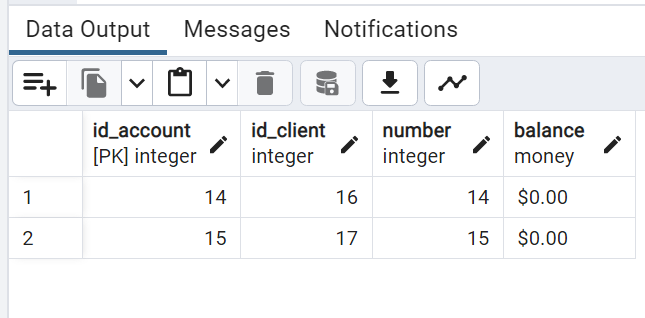

### Realização de transações

Ao realizar uma sequência de saques e depósitos na conta de número 14, podemos ver o histórico a partir do método listtransaction:

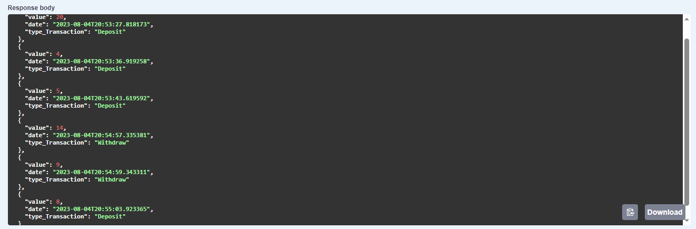

Abaixo estão os dados no banco, nota-se que no método implementado os dados aparecem por ordem de data/horário, no banco não.

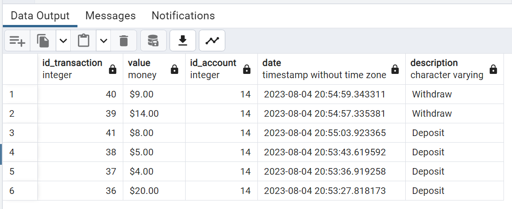

Visualização de saldo:

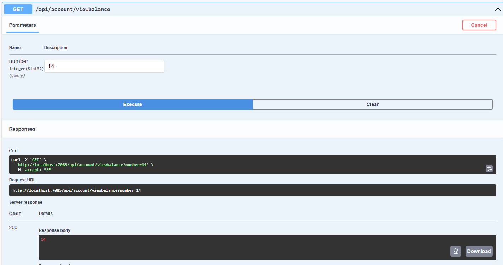

### Atualização de dados de cliente

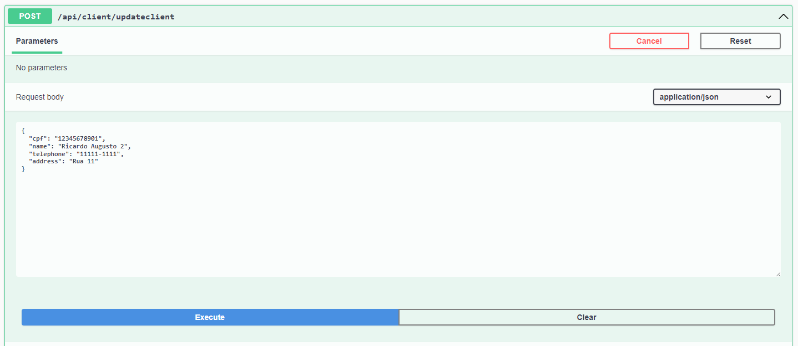

Print do banco:

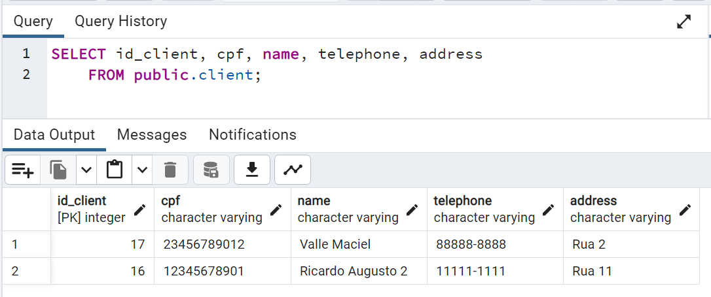

### Listagem de clientes:

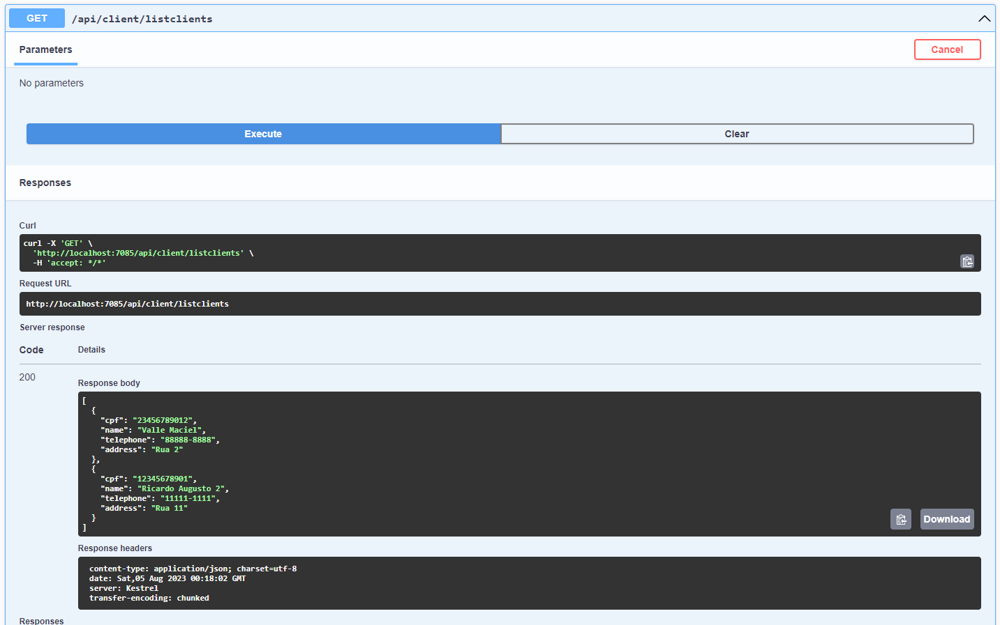

### Busca de cliente pelo CPF:

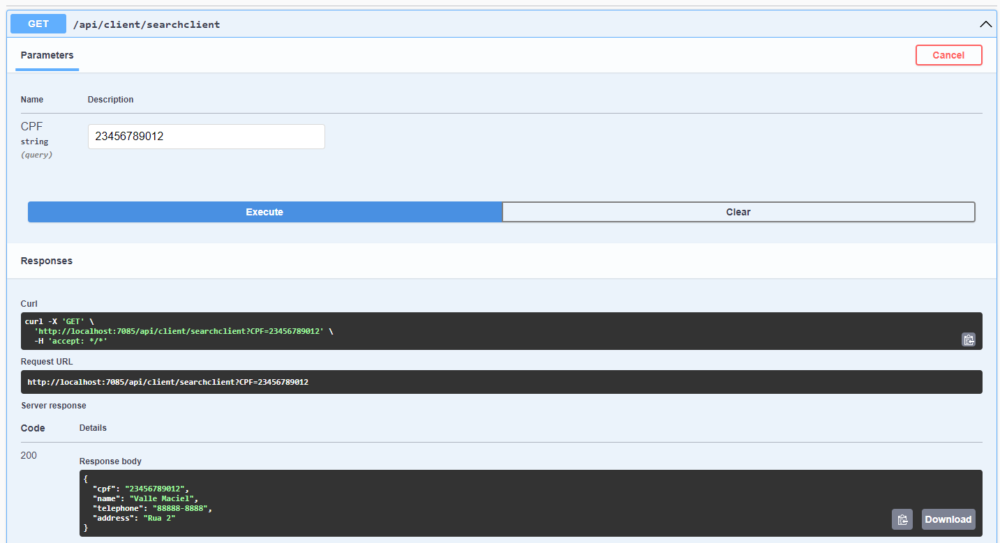

### Apagando dados dos clientes

E por fim, a função DeleteClientAccount que apaga os dados do cliente, da sua conta e das transações associadas a conta.

Deletando a conta 14:

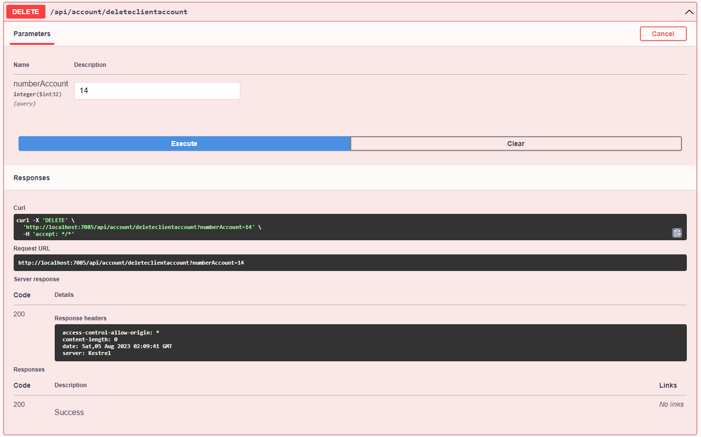

Print dos bancos sem o cliente "Ricardo Augusto" e sem os dados da conta e das transações:

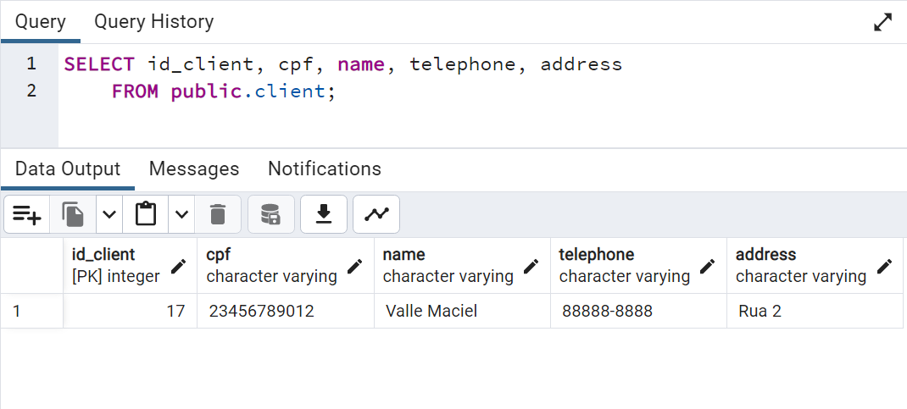

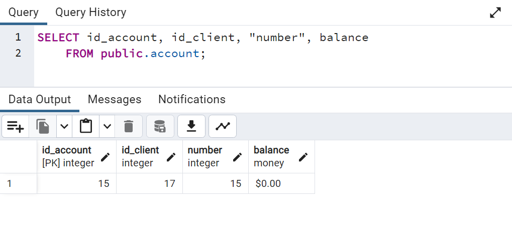

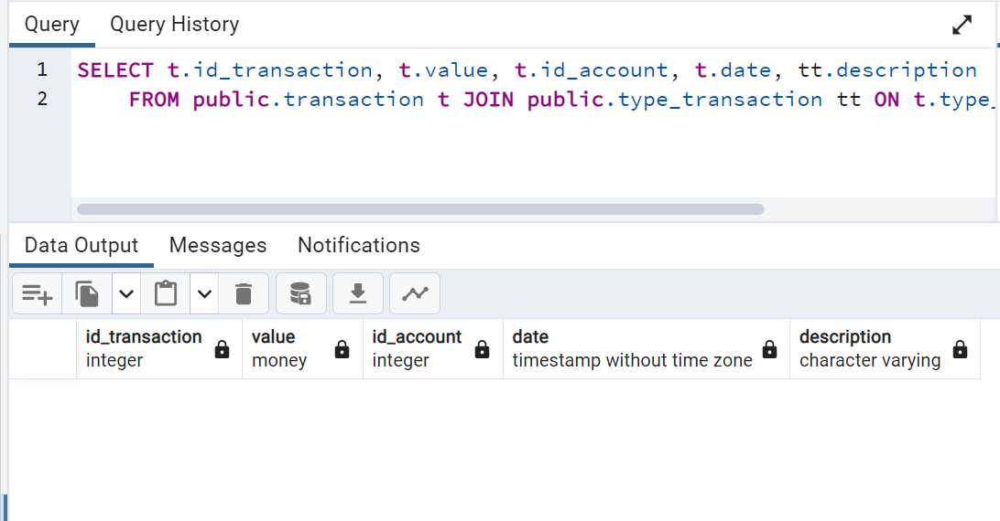