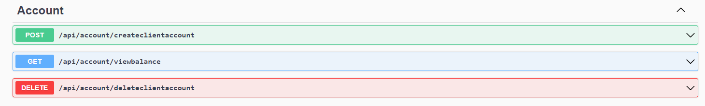
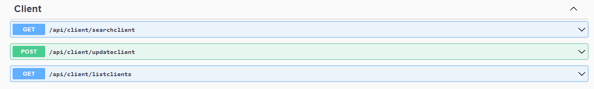
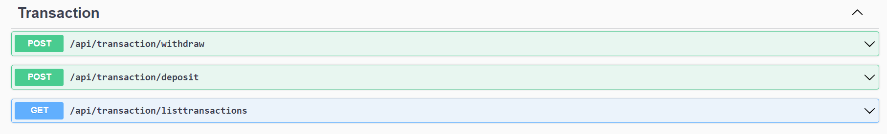

# Desafio BTG

Projeto destinado ao desenvolvimento de um sistema de contas digitais. Tal desafio foi elaborado pelo processo seletivo do BTG Pactual.

## Tabela de Conteúdos

- Introdução
- Tecnologias Utilizadas
- Modelo Entidade-Relacionamento
- Diagrama Entidade-Relacionamento
- Endpoints da API

## Introdução

Para o desenvolvimento do sistema, foi realizada a modelagem de um banco de dados relacional contendo dados do cliente, dados da conta e dados de movimentação, trabalhando apenas com saques e depósitos.

Após a modelagem, foi feita uma API do sistema com funções de cadastro de cliente/conta, visualização de saldo, deletar dados de cliente, conta e transações; pesquisa de dados do cliente a partir do CPF, atualizar dados do cliente, visualizar lista de clientes; realizção de saque (caso o cliente tenha saldo suficiente), depósito e visualização de lista de transações da conta.

## Tecnologias Utilizadas

Para o desenvolvimento do sistema, foi escolhido um conjunto de tecnologias modernas e também utilizadas dentro do BTG Pactual. Como banco de dados, foi utilizado o PostgreSQL. A hospedagem do banco foi realizada na AWS RDS (Amazon Web Services Relational Database Services), aproveitando a escalabilidade e confiabilidade da nuvem para gerantir um sistema seguro. Quanto ao desenvolvimento da aplicação, foi utilizada a plataforma .NET, aproveitando seu framework para criar uma API completa, fornecendo uma ótima experiência aos usuários.

## Modelo Entidade-Relacionamento

Entidades:

- Client
- Account
- Transaction

Atributos:

- Client: id_client, cpf, name, telephone, address
- Account: id_account, id_client, number, balance
- Transaction: id_transaction, id_account, value, data, type_transaction

Relacionamentos:

- Client 1 --- 1 Account

Essa modelagem está trabalhando com contas de apenas um tipo, com isso um cliente estará associado a apenas uma conta e uma conta será vinculada a apenas um cliente.

- Account 1 --- N Transaction

Uma conta pode realizar mais de uma movimentação, mas uma movimentação está associada a apenas uma conta (pois no caso trabalhado as transações são apenas de saques e depósitos).

## Diagrama Entidade-Relacionamento

Os Scripts DDL e DML estão presentes nas pastas [DDL](docs/DDL) e [DML](docs/DML).

Para a utlização dos scripts envolvendo a tabela Transaction, é importante informar que as inserções diretas nela (como INSERT ou UPDATE) não irão afetar o valor do saldo na tabela Account. O valor da transação altera o valor do saldo por meio dos códigos, logo, para realizar saques e depósitos é necessário utilizar a API.

## Endpoints da API

Os endpoints foram dividos em funções ligadas aos clientes, as contas e as transações.

### Conta:

A função CreateClientAccount recebe como parâmetro os atributos do cliente (cpf, nome, telefone e endereço), cadastra ele no banco de clientes e já cria automaticamente uma conta acossiada a ele.

A função ViewBalance recebe como atributo o número da conta e retorna seu saldo.

A função DeleteClientAccount recebe como parâmetro o número da conta e apaga todas as informações no banco relacionadas as transações, a conta e ao cliente acossiado a ela.

### Cliente:

A função SearchClient recebe como parâmetro o cpf do cliente e retorna todas as suas informações.

A função UpdateClient recebe os atributos de cliente e atualiza os dados de nome, telefone e endereço do cliente, a busca é feita a partir do cpf.

A função ListClients não recebe parâmetros e retorna uma lista com todos os clientes cadastrados no banco de dados.

### Transações:

A função Withdrar recebe o número da conta e o valor do saque e retira esse valor de seu saldo.

A função Deposit tem uma funcionalidade parecida com a Withdraw, mas para depósitos.

A ListTransactions recebe o número da conta e retorna uma lista com os dados de transações realizadas, sendo eles o valor da transação, a data e hora o tipo, sendo saque ou depósito.
